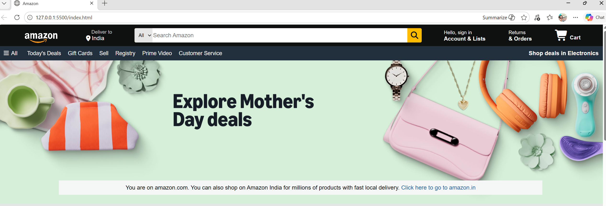
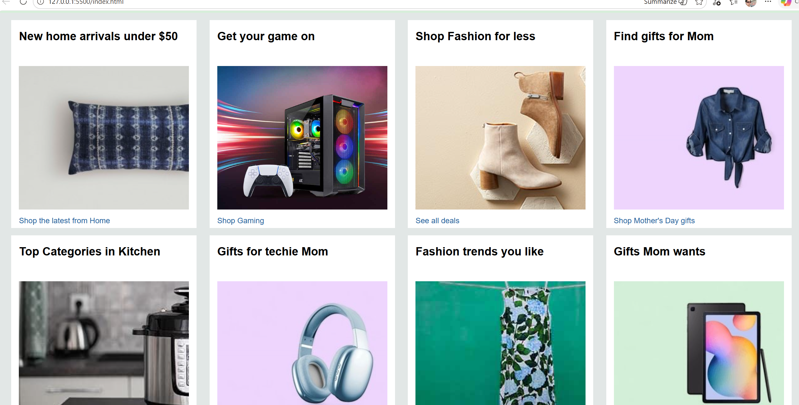
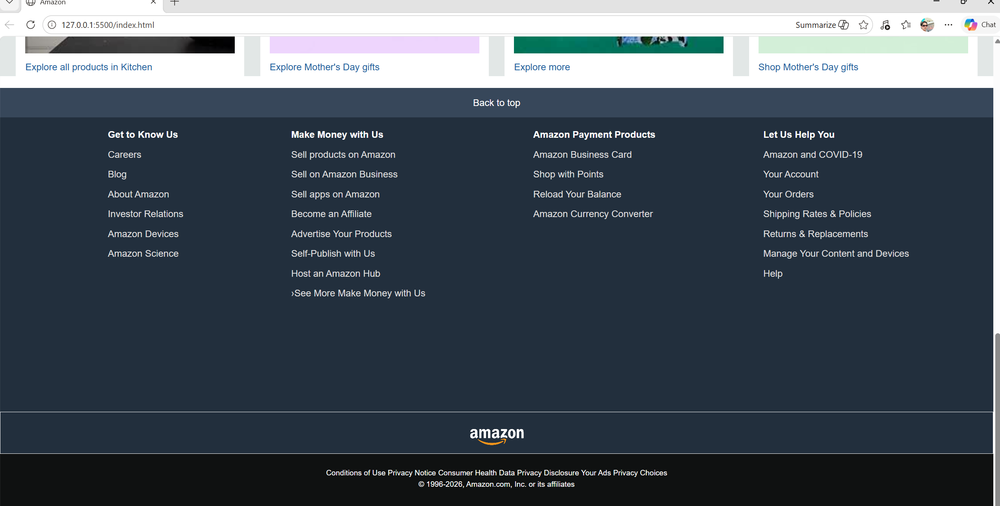

# 🛒 Amazon Clone (HTML & CSS)

A responsive Amazon homepage clone built using **HTML5 and CSS3**.

## 🚀 Features

* Amazon-like navigation bar
* Search bar UI
* Product grid layout
* Hero banner section
* Footer section
* Clean UI and layout

## 🖼️ Preview

## 🛠️ Tech Stack

* HTML5
* CSS3
* Font Awesome

## 📂 Project Structure

* index.html
* style.css
* images/

## ▶️ How to Run

1. Download or clone the repo
2. Open `index.html` in your browser

## 📌 Future Improvements

* Add JavaScript functionality
* Make it fully responsive
* Add product pages
* Add login/signup UI

## 🙌 Author

Prajjwal Pandey
 
Contact me - prajjwalpandey171@gmail.com
